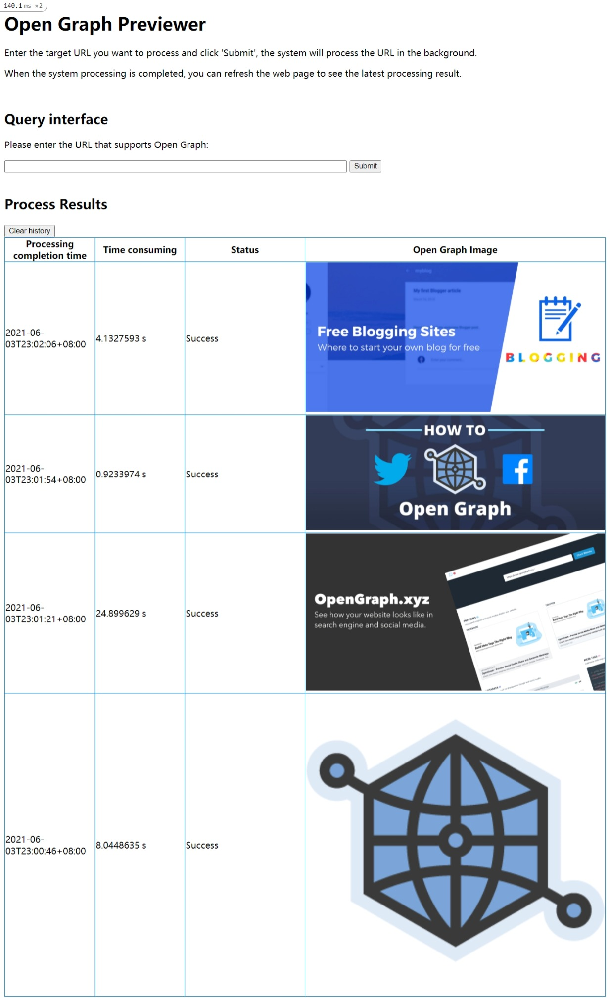

# Open Graph Previewer


## Development Environment

* Operating System: Windows 10

* IDE: JetBrains RubyMine


## How to run it

First change your working directory to the project path:

```shell
cd <PROJECT_PATH>
```

Please make sure you have installed the software tools mentioned in the Rails Guides:

[Getting Started with Rails — Ruby on Rails Guides](https://guides.rubyonrails.org/getting_started.html)

```
Ruby
SQLite3
Node.js
Yarn
```

And install `Ruby on Rails`:

```shell
gem install rails
```

Execute the following command to install all required gems:

```
bundle install
```

On a Windows computer, we execute the following command to start the server:

```
ruby .\bin\rails server -b 127.0.0.1 -p 3000 -e production
```

For Unix systems, the commands that need to be executed are similar to the above:

```
bin/rails server -b 127.0.0.1 -p 3000 -e production
```

Please use your favorite browser to visit: `http://localhost:3000`

You will see a page like below:



Enter the Open Graph URL you want to process in the input box, and click the "Submit" button to submit it to the system.

The system will process these Open Graph URLs in the background, and add the processing results to the `@@results` array after the processing is over.

Because the system processing is performed asynchronously, the web page may not display the latest submitted processing result in a timely manner.

For those latest submissions, we may need to manually refresh the web page to see their processing results after the system is processed.


## Main Body

I designed an `OgPreviewerController` controller in this project, and its routing address is `og_previewer/index`

```ruby
Rails.application.routes.draw do
  root 'og_previewer#index'
  get 'og_previewer/index'
end
```

This program requires 2 important gems to handle the Open Graph URL:

```ruby
gem 'faraday'
gem 'ogp'
```

Using threads and a mutex, we can process Open Graph URLs asynchronously.

Now we can do batch processing faster.

However, there is no guarantee that the webpage can immediately give the 
processing result of the latest submission.

For the latest results, we need to refresh the page manually after the system 
finishes processing.

The comments in the code will explain some other details.